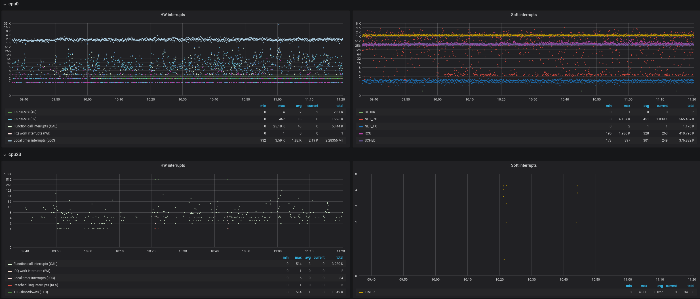
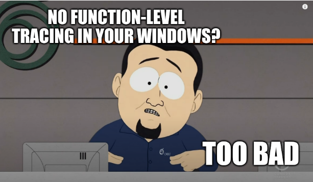
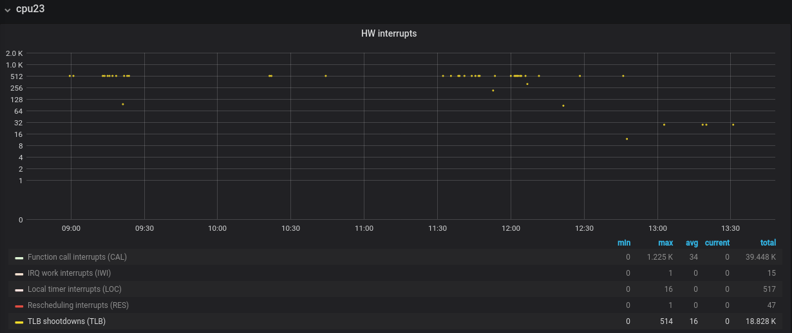
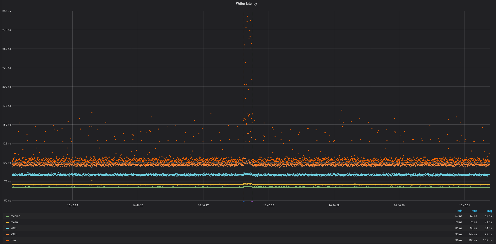

## The problem

Every once in a while I get involuntarily involved in heated debates about whether reusing memory is better for performance than freeing it.  
**TLDR**: it is. If you want to find out why read on.

Now, I like to follow other systems performance specialists such as Martin Thompson or Brendan Gregg and normally just uncritically accept whatever they have to say about pretty much anything.
Especially when they talk about [CPU caches](https://en.wikipedia.org/wiki/CPU_cache), TLB misses or invoke other terms that I always acknowledge with nervous laugh while noting it down to check it out later.  
This time my peers were totally unimpressed by my convoluted explanations as if they actually knew I had no idea what I was talking about.
And so I was kind of forced onto this path of misery, doubt and self-loathing that some people call "doing research".

Because I'm not the sharpest tool in the shed I take longer to learn new things and require working examples for everything. 
I decided to steal someone else's code from Stack Overflow and find out for myself if reusing memory is more efficient than just freeing it and letting the allocator do its magic.
Unfortunately there was nothing to steal except for academic discussions on some side effects of freeing (unmapping) memory.

Fun fact: the reason for associating _free()_ with _munmap()_ is that some allocations with _malloc()/calloc()_ will not use _sbrk()_ and fall back to _mmap()_ under the hood (with corresponding _munmap()_ to free memory).  
It's really well captured in the [original documentation](https://linux.die.net/man/3/malloc):

> Normally, malloc() allocates memory from the heap, and adjusts the size of the heap as required, using sbrk(2). When allocating blocks of memory larger than MMAP_THRESHOLD bytes, the glibc malloc() implementation allocates the memory as a private anonymous mapping using mmap(2). MMAP_THRESHOLD is 128 kB by default, but is adjustable using mallopt(3). Allocations performed using mmap(2) are unaffected by the RLIMIT_DATA resource limit (see getrlimit(2)).

Regardless of the method by which your program acquired memory there are side effects of freeing/reclaiming it.
This post focuses on the impact of so called **TLB-shootdowns**.

Due to the mechanics of handling memory loads and stores in modern hardware and the supporting physical design of most contemporary CPUs, threads running in the same [VAS](https://en.wikipedia.org/wiki/Virtual_address_space) will negatively impact one another just by deallocating memory.  
In formal terms: 
> For a single program P its thread T<sub>0</sub> running on CPU<sub>0</sub> is expected to disrupt P's thread T<sub>1</sub> running on CPU<sub>1</sub> solely by the virtue of performing memory de-allocation within the same address space.  

In my terms: within the same program, threads can mess with other threads by freeing memory those other threads aren't even using.    
You can probably guess how some react to a ludicrous statement like this.

  
  
I don't blame them; the first time around that was my reaction too.

## The theory


In order to understand the phenomenon we have to explore the anatomy of a few crucial components and their mutual interactions.
I'll assume we all know what [virtual memory](https://en.wikipedia.org/wiki/Virtual_memory) is as a concept and start from here.
  
When the CPU executes an instruction that accesses some part of memory, the address points to a virtual and not physical address.
This virtual address has to be translated to the physical address; this means that there has to be some mapping maintained that when given a virtual address returns a corresponding physical address.
Such mapping is maintained in the [page table](https://en.wikipedia.org/wiki/Page_table).  
Nowadays these structures are quite complex with up to [5 levels](https://en.wikipedia.org/wiki/Intel_5-level_paging) from [Intel's Icelake](https://en.wikipedia.org/wiki/Ice_Lake_(microprocessor)) onwards.
Here's some [nice read](https://lwn.net/Articles/717293/) on how this support came to be in Linux and how stuff works at this level of complexity.
Now, because this mapping has to be performed for each and every memory access the process of going to the page table, finding corresponding level 1 entry and following deeper into levels 4 or even 5 seems like a lot of work for every instruction that refers to a memory location. 
There's a lot of pointer chasing involved so such overhead would degrade our computers' performance by orders of magnitude.  

So why don't we see this happening? Enter the [TLB](https://en.wikipedia.org/wiki/Translation_lookaside_buffer).

Just like CPU caches data residing in RAM, the TLB caches the virtual-to-physical address mappings so we don't have to go through the pain of inspecting page table every single time the CPU needs to do anything (btw, this process is called page walk).
Nowadays, on x86 there are separate TLBs for data (dTLB) and instructions (iTLB). What's more - just like CPU caches - they are divided into access levels.
For example Intel's Xeon E5-2689 v4 [has 5 TLB caches](http://www.cpu-world.com/CPUs/Xeon/Intel-Xeon%20E5-2689.html):
* Data TLB0: 2-MB or 4-MB pages, 4-way set associative, 32 entries
* Data TLB: 4-KB Pages, 4-way set associative, 64 entries
* Instruction TLB: 4-KB pages, 4-way set associative, 64 entries
* L2 TLB: 1-MB, 4-way set associative, 64-byte line size
* Shared 2nd-level TLB: 4 KB pages, 4-way set associative, 512 entries 

Fun fact: the first hardware cache used in a computer system was not actually a data or instruction cache, [but rather a TLB](http://www.chilton-computing.org.uk/acl/technology/atlas/p019.htm).  
To make things more interesting there are 4 types of CPU caches that interact with TLB differently:
* Physically indexed, physically tagged (PIPT) caches use the physical address for both the index and the tag. While this is simple and avoids problems with aliasing, it is also slow, as the physical address must be looked up (which could involve a TLB miss and access to main memory) before that address can be looked up in the cache.
* Virtually indexed, virtually tagged (VIVT) caches use the virtual address for both the index and the tag. This is a pretty dodgy scheme, not used broadly due to its problems with aliasing (multiple virtual addresses pointing to the same physical address) causing coherency challenges or homonyms where the same virtual address maps to several different physical addresses. 
* Virtually indexed, physically tagged (VIPT) caches use the virtual address for the index and the physical address in the tag. They are faster than PIPT because a cache line can be looked up in parallel with the TLB translation (with tag comparison delayed until the physical address is available). This type of cache can detect homonyms.
* Physically indexed, virtually tagged (PIVT) caches. Not very useful these days (only [MIPS R6000](https://www.linux-mips.org/wiki/TLB) had one).

Most level-1 caches are virtually indexed nowadays, which allows a neat performance trick where the [MMU's](https://en.wikipedia.org/wiki/Memory_management_unit) TLB lookup happens in parallel with fetching the data from the cache RAM.
Due to aliasing problem virtual indexing is not the best option for all cache levels. Aliasing overhead gets even bigger with the cache size. Because of that most level-2 and larger caches are physically indexed.

So that clears things up, doesn't it?

  

I struggled with these concepts for a while and highly recommend watching an [explanatory video](https://www.youtube.com/watch?v=95QpHJX55bM) that shows how TLB works for different cases (misses vs hits). [Another one](https://www.youtube.com/watch?v=uyrSn3qbZ8U&t=191s) focuses more on how employing TLB improves performance of memory accesses. 
Although simplified I found these videos a great starting point if you would like to get a better understanding of this particular part of memory management on modern platforms.    

Mind you, these show the world of hardware TLBs, however there are architectures that either entirely rely on TLB done in software (MIPS) or support software and hardware (SPARC v9).  

We know that TLB is essentially a cache of page table entries and a very small one at that (at least compared to CPU caches). 
This means we have to be very careful not to introduce pathological memory access patterns in our program as this would mess with the TLB and we'd have to pay the price of TLB misses.  

Depending on the scenario updating the TLB can be performed by the Linux kernel using different interfaces:
* _void flush_tlb_all(void)_ - The most severe flush of all. After this interface runs, any previous page table modification whatsoever will be visible to the cpu.
This is usually invoked when the kernel page tables are changed, since such translations are “global” in nature.

* _void flush_tlb_mm(struct mm_struct *mm)_ - This interface flushes an entire user address space from the TLB. After running, this interface must make sure that any previous page table modifications for the address space ‘mm’ will be visible to the cpu. That is, after running, there will be no entries in the TLB for ‘mm’.
This interface is used to handle whole address space page table operations such as what happens during [fork](http://man7.org/linux/man-pages/man2/fork.2.html), and [exec](https://linux.die.net/man/3/exec).

* _void flush_tlb_range(struct vm_area_struct *vma, unsigned long start, unsigned long end)_ - Here we are flushing a specific range of (user) virtual address translations from the TLB. After running, this interface must make sure that any previous page table modifications for the address space ‘vma->vm_mm’ in the range ‘start’ to ‘end-1’ will be visible to the cpu. That is, after running, there will be no entries in the TLB for ‘mm’ for virtual addresses in the range ‘start’ to ‘end-1’.
The “vma” is the backing store being used for the region. Primarily, this is used for munmap() type operations.
The interface is provided in hopes that the port can find a suitably efficient method for removing multiple page sized translations from the TLB, instead of having the kernel call flush_tlb_page (see below) for each entry which may be modified.

* _void flush_tlb_page(struct vm_area_struct *vma, unsigned long addr)_ - This time we need to remove the PAGE_SIZE sized translation from the TLB. The ‘vma’ is the backing structure used by Linux to keep track of mmap’d regions for a process, the address space is available via vma->vm_mm. Also, one may test (vma->vm_flags & VM_EXEC) to see if this region is executable (and thus could be in the ‘instruction TLB’ in split-tlb type setups).
After running, this interface must make sure that any previous page table modification for address space ‘vma->vm_mm’ for user virtual address ‘addr’ will be visible to the cpu. That is, after running, there will be no entries in the TLB for ‘vma->vm_mm’ for virtual address ‘addr’.
This is used primarily during fault processing.

* _void update_mmu_cache(struct vm_area_struct *vma, unsigned long address, pte_t *ptep)_ - At the end of every page fault, this routine is invoked to tell the architecture specific code that a translation now exists at virtual address “address” for address space “vma->vm_mm”, in the software page tables.
A port may use this information in any way it so chooses. For example, it could use this event to pre-load TLB translations for software managed TLB configurations. The sparc64 port currently does this.

Invalidating ranges or individual TLB entries is also affected by your CPU's support for the _PCID_ feature (Process Context Identifier). On instruction level there are two options: there's the "legacy" [_invlpg_](https://www.felixcloutier.com/x86/invlpg) instruction used on platforms without _PCID_
and a newer one called ([_INVPCID_](https://www.felixcloutier.com/x86/invpcid)). If I'm not mistaken, the latter has been available from around Sandy Bridge onward.

A simple example of when a TLB update is required is a context switch, when the CPU is about to execute code in an entirely different virtual address space.
But that case is easy to understand, follow and even trace. Other TLB-shootdowns may be much more subtle and often come from the hand of a backstabbing thread from our own process.
  
To put the impact of TLB-assisted address translation in numbers: 
- a hit takes 0.5 - 1 CPU cycle
- a miss can take anywhere between 10 to even hundreds of CPU cycles. 

Now that we know everything about TLBs it's time to describe what a TLB shootdown is and how we can measure its impact.

Imagine a process with two threads running on two separate CPUs. They both allocate some memory to work with (let's call it chunk A). They later decide to allocate some more memory (chunk B). Eventually they only work on chunk B and don't need chunk A any more so one of the threads calls _free()_ to release unused memory back to the OS.
What happens now is that the CPU which executed the _free()_ call has perfect information about valid mappings because it flushed outdated entries in its own TLB. But what about the other CPU running the other thread of the same process?
How does it know that some virtual-to-physical mappings are not legal any more? We mustn't let it access addresses that map to physical memory that has been freed and can now belong to some completely different process, can we? I mean, that would be really bad memory coherency :)

There is no such thing as [bus snooping](https://en.wikipedia.org/wiki/Bus_snooping) for TLBs so how do other CPUs in an SMP system know when and what to invalidate?
This is where we finally get to meet Mr TLB-shootdown in person. 
It goes more or less like this. Thread A calls _free()_ which eventually propagates to the OS which knows which other CPUs are currently running threads that might access the memory area that's about to get freed. The OS code raises an [IPI (inter-processor interrupt)](https://en.wikipedia.org/wiki/Inter-processor_interrupt) that targets those specific CPUs to tell them to pause whatever they're doing now and first invalidate some virtual-to-physical mappings before resuming work.
Note: IPIs are also used to implement other functionality like signaling timer events or rescheduling tasks.

In Linux kernel there's a really cool function called [smp_call_function_many](https://elixir.bootlin.com/linux/v4.15/source/kernel/smp.c#L403) which generally lets you call functions on other CPUs. 
So when the OS wants to tell a bunch of CPUs to immediately invalidate their TLBs it uses the _smp_call_function_many_ facility with appropriate CPU mask to invoke a dedicated function on each of the 
qualifying CPUs: [flush_tlb_func_remote](https://elixir.bootlin.com/linux/v4.15/source/arch/x86/mm/tlb.c#L510). 
It's all nicely encapsulated in [native_flush_tlb_others](https://elixir.bootlin.com/linux/v4.15/source/arch/x86/mm/tlb.c#L520) 
function and I strongly recommend you have a look to get a better understanding of what is really going on when this happens. 

If our understanding is correct, we should see an execution stall on an unsuspecting thread that's doing its own thing when suddenly it gets hit with a giant IPI hammer. How do we even measure this?

## The reality

First things first - we need a proof of concept program to provide hard evidence for our hypothesis.
In the [Theory](#the-theory) section we devised a hypothetical test case with thread A backstabbing thread B with IPIs. Let's write [some code](https://github.com/bitcharmer/tlb_shootdowns/blob/master/src/main.c) then.
At this point I feel like I need to make a strong statement about code quality, defensive programming, error checking and such.
Look closely - you will find none of that in this program. I make a strong distinction between a production-quality code and experimental sandbox stuff that you just write to have fun or learn.
If this code makes you uncomfortable, then by all means please feel free to submit a PR that makes it less savage and I will gladly merge it.  
With this important announcement out of the way we can finally look at what it does:

1. Pins the main thread to the CULPRIT_CPU
2. Allocates chunkA and chunkB on local NUMA node
3. Spawns the victim thread, which:
    1. pins itself to VICTIM_CPU
    2. traverses chunkA once to fill the TLB
    3. switches to chunkB and starts looping over it indefinitely while capturing latency of touching pages (in batches)
4. Culprit thread waits for user input
5. After receiving input culprit thread frees chunkA
6. Waits a short while before dumping stats to influxdb
7. Profit

This is of course a simplified description of what's happening so if you want details, please have a look at the code.


There is only one external dependency in this code and that is [HDR Histogram](https://github.com/HdrHistogram/HdrHistogram_c). It's a brilliant piece of software that uses 
unhealthy amounts of bit-twiddling magic and some hardcore maths to offer cheap, efficient and very low-overhead histogram implementation. 
It also has extremely small memory footprint which matters here a lot as we can't afford to be compute or memory intensive. 
Otherwise we'd have to deal with the observation introducing too much noise into the experiment.
You have to clone and build it before you will be able to compile tlb_shootdowns binary.   

  
Important note - measuring performance of hardware caches is extremely difficult and super easy to get wrong. This is mostly due to the timescales (of nanoseconds) 
and the subtle character of the impact this type of interactions make.
For that reason this exercise only makes sense if performed on a reasonably tuned system. You will need to get rid of the major sources of jitter (at least from the culprit and victim cpus) such as:
- other user space threads (including [SMT](https://en.wikipedia.org/wiki/Simultaneous_multithreading))
- kernel threads (rcu, workqueues, tasklets)
- irqs
- vm.stat_interval, any sources of sysfs or debugfs pressure

On top of the above you will need to make sure you mitigate other factors that have potential to introduce too much variance like 
irq balancing, rcu storms, timer tick waves, [switching c-states and p-states](https://software.intel.com/content/www/us/en/develop/articles/power-management-states-p-states-c-states-and-package-c-states.html), watchdogs, audits, [MCEs](https://en.wikipedia.org/wiki/Machine-check_exception), writeback activity, etc.
Here's the setup I used:

`BOOT_IMAGE=/boot/vmlinuz-4.15.0-lowlatency root=UUID=5d18206d-fea3-44b0-bbc5-65274f690bc4 ro quiet splash vt.handoff=1 isolcpus=10,11,22,23 nohz_full=10,11,22,23 rcu_nocbs=10,11,22,23 noht nosoftlockup intel_idle.max_cstate=0 mce=ignore_ce rcu_nocb_poll audit=0 hpet=disable edd=off idle=poll processor.max_cstate=0 transparent_hugepage=never intel_pstate=disable numa_balancing=disable tsc=reliable clocksource=tsc selinux=0 nmi_watchdog=0 cpuidle.off=1 skew_tick=1 acpi_irq_nobalance pcie_aspm=performance watchdog=0 nohalt hugepages=4096 nospectre_v1 nospectre_v2 spectre_v2=off nospec_store_bypass_disable nopti pti=off nvidia-drm.modeset=1`

Your kernel has to support nohz_full and rcu offloading. If you want to be able to hook into kernel functions, you will also need debug symbols. For clarity I dumped my [.config](https://github.com/bitcharmer/tlb_shootdowns/blob/master/.config) in this repo as well.

Here's more details on my setup:

Component | Specs
--- | ---
CPU | 2 x Intel(R) Xeon(R) CPU E5-2680 v3 @ 2.50GHz (24 hw threads total)
Mobo | Asus Z10PE-D8 WS (dual socket)
RAM | 4 x 16GB DDR4 @ 2133 MHz (0.5ns)
Kernel | custom low-latency 4.15 kernel 

 
I ran my tests on runlevel 3 where I have most services disabled.   
Additionally, it made more sense to run the benchmark on NUMA node1 as node0 typically experiences noticeably more activity and cache trashing:

  


After setting up the environment we're finally ready to check if this whole IPI magic actually takes place as predicted.  

The reason why Windows sucks and Linux rocks is that to systems engineers like myself it's like the Wünder Waffe. 
It's got everything you can ever wish for and more.
The level of introspection into the kernel that's available, tracing, profiling, custom probes, advanced tooling is just stupidly awesome. 
Does it show that I'm drooling?

Brendan Gregg is the go to person when it comes to [Linux performance](http://www.brendangregg.com/); his site is an invaluable source of wisdom on the topic and you should definitely go and check it out.
Out of the whole arsenal of available tools conveniently listed on his website, for quick and dirty analysis I often choose [Systemtap](https://sourceware.org/systemtap/wiki).     
As the name suggests the tool taps into a well established and defined [trace points](https://www.kernel.org/doc/Documentation/trace/tracepoint-analysis.txt) in Linux kernel. 
It can also hook into raw kernel functions and gain access to some of the function parameters or even global variables. 
To get the list of trace points supported by your kernel just run:

`stap -L 'kernel.trace("*")'`


For the list of functions you can tap into:

`sudo stap -L 'kernel.function("*")'`

The latter won't work without sudo as it needs full access to `/proc/kallsyms`.


  


Before we start measuring things we need to confirm that the whole IPI nonsense does indeed happen. Systemtap is perfect for that.
I wrote a [script](https://github.com/bitcharmer/tlb_shootdowns/blob/master/trace_ipi.stp) that does everything we need and spits out relevant details to stdout.
So let's run it and then start our program and see what happens!

```
VICTIM: tlb flush, reason: TLB_FLUSH_ON_TASK_SWITCH
VICTIM: tlb flush, reason: TLB_LOCAL_MM_SHOOTDOWN
VICTIM: tlb flush, reason: TLB_LOCAL_MM_SHOOTDOWN
VICTIM: ipi enter
VICTIM: tlb flush, reason: TLB_FLUSH_ON_TASK_SWITCH
VICTIM: tlb flush, reason: TLB_FLUSH_ON_TASK_SWITCH
VICTIM: tlb flush, reason: TLB_LOCAL_MM_SHOOTDOWN
VICTIM: tlb flush, reason: TLB_LOCAL_MM_SHOOTDOWN
VICTIM: tlb flush, reason: TLB_LOCAL_MM_SHOOTDOWN
```

Ok, so far nothing exciting, these are all part of getting a new thread onto a CPU and giving it some memory; totally expected. No sign of any traumatic interaction with the culprit thread.
Then the culprit thread pauses waiting for user input:

```
./tlb_shootdowns
Allocating chunks...
Spawned victim thread...
Victim finished warming up. Performing measured writes...
Press enter to free chunkA...
```

Hit Enter!

```
CULPRIT: raising ipi
VICTIM: ipi enter
VICTIM: tlb flush, reason: TLB_REMOTE_SHOOTDOWN
CULPRIT: raising ipi
VICTIM: ipi enter
VICTIM: tlb flush, reason: TLB_REMOTE_SHOOTDOWN
CULPRIT: raising ipi
VICTIM: ipi enter
VICTIM: tlb flush, reason: TLB_REMOTE_SHOOTDOWN
CULPRIT: raising ipi
VICTIM: ipi enter
VICTIM: tlb flush, reason: TLB_REMOTE_SHOOTDOWN
CULPRIT: raising ipi
VICTIM: ipi enter
VICTIM: tlb flush, reason: TLB_REMOTE_SHOOTDOWN
CULPRIT: raising ipi
VICTIM: ipi enter
VICTIM: tlb flush, reason: TLB_REMOTE_SHOOTDOWN
```

Wow, this is what I call causing a mess. There's many more of those but this is more than enough to show that our assumptions were valid.
BTW, you don't need to write and run a Systemtap script to check if a CPU of interest experienced any TLB-shootdowns. 
You can monitor /proc/interrupts or use something more user-friendly like [Telegraf](https://www.influxdata.com/time-series-platform/telegraf/) agent and plot awesome charts in [Grafana](https://grafana.com):



With Systemtap however you get much more details and scripting capabilities.

Before I get to the part everyone's been waiting for (if you're still here) I need to make another disclaimer. It's very easy to run benchmarks like this and not reach any definite conclusion. 
This has to do with how fast your memory is, how much of it you have at your disposal, how fast your CPUs are and even how you decide to collect, process and present the data.
Some of my test runs gave less pronounced results at higher level of background noise, some were better.
Tuning the basic parameters for this test is like doing multivariate nonlinear regression - easy and totally not frustrating. In my case the following combination performed well:

```
#define WRITER_BATCH_SIZE_KB 64                     // write into this much worth of pages and capture the time
#define REPORT_STATS_EVERY_MB 32                    // every N megabytes we'll dump percentiles into our "time series"
#define ALLOC_SIZE 4L * 1024L * 1024L * 1024L       // using 4 GB chunks
```


Once we confirmed that indeed the call to _free()_ on the culprit thread unleashes all this mess, we can finally look at the magnitude of the execution stall
on the affected CPU: 


   

The vertical lines are markers for the exact time the culprit thread called _free()_ (blue - just before, purple - just after), 
so this is just an extra confirmation that we're looking at the actual time frame of interest.  


For most applications execution stalls like this don't matter much as they don't have strict performance requirements. 
However for programs that are expected to operate in low- and ultra-low latency regime this may be a serious issue. 
I've worked on quite a few systems that employed either pure in-mem buffers/arenas or used file-backed mapped memory.
Large journal files may be a potential problem for operations and maintenance. Because of that there was always some pressure on unmapping and removing them.
The resulting debates on the consequences of releasing memory were not uncommon; I hope this material gave you a better understanding of the nature of this issue.


## Bonus content

For the inquisitive, here's how the interaction between the threads transpires.

Culprit's backtrace:


Address | Function
--- | ---
0xffffffff81055d10 | [native_send_call_func_single_ipi](https://elixir.bootlin.com/linux/v4.15/source/arch/x86/kernel/smp.c#L134)+0x0/0x20 [kernel]
0xffffffff8111f86f | [generic_exec_single](https://elixir.bootlin.com/linux/v4.15/source/kernel/smp.c#L141)+0x5f/0xc0 [kernel]
0xffffffff8111f9a2 | [smp_call_function_single](https://elixir.bootlin.com/linux/v4.15/source/kernel/smp.c#L268)+0xd2/0x100 [kernel]
0xffffffff8111fe3c | [smp_call_function_many](https://elixir.bootlin.com/linux/v4.15/source/kernel/smp.c#L403)+0x1cc/0x250 [kernel]
0xffffffff8107982c | [native_flush_tlb_others](https://elixir.bootlin.com/linux/v4.15/source/arch/x86/mm/tlb.c#L523)+0x3c/0xf0 [kernel]
0xffffffff8107998e | [flush_tlb_mm_range](https://elixir.bootlin.com/linux/v4.15/source/arch/um/kernel/tlb.c#L527)+0xae/0x110 [kernel]
0xffffffff81208a50 | [tlb_flush_mmu_tlbonly](https://elixir.bootlin.com/linux/v4.15/source/mm/memory.c#L242)+0x80/0xe0 [kernel]
0xffffffff81209e1f | [arch_tlb_finish_mmu](https://elixir.bootlin.com/linux/v4.15/source/mm/memory.c#L276)+0x3f/0x80 [kernel]
0xffffffff81209fd3 | [tlb_finish_mmu](https://elixir.bootlin.com/linux/v4.15/source/mm/memory.c#L415)+0x23/0x30 [kernel]
0xffffffff81213c07 | [unmap_region](https://elixir.bootlin.com/linux/v4.15/source/mm/mmap.c#L2501)+0xf7/0x130 [kernel]
0xffffffff81215d6c | [do_munmap](https://elixir.bootlin.com/linux/v4.15/source/mm/mmap.c#L2635)+0x27c/0x460 [kernel]
0xffffffff81215fb9 | [vm_munmap](https://elixir.bootlin.com/linux/v4.15/source/mm/mmap.c#L2736)+0x69/0xb0 [kernel]
0xffffffff81216022 | [sys_munmap](https://elixir.bootlin.com/linux/v4.15/source/include/linux/syscalls.h#L498)+0x22/0x30 [kernel]
0xffffffff81003b34 | [do_syscall_64](https://elixir.bootlin.com/linux/v4.15/source/arch/x86/entry/common.c#L268)+0x74/0x1b0 [kernel]
0xffffffff81a00119 | [return_from_SYSCALL_64](https://elixir.bootlin.com/linux/v4.15/source/arch/x86/entry/entry_64.S#L323)+0x0/0x65 [kernel]
0x0 | ring3 to ring0 transition (user- to kernel-space) 
0x7f0853529ab7 | [munmap](https://elixir.bootlin.com/glibc/glibc-2.27/source/malloc/memusage.c#L749)+0x7/0x30 [/lib/x86_64-linux-gnu/libc-2.27.so]
0x55e3788866dd | main+0x180/0x243 [/home/qdlt/devel/git/tlb_shootdowns/tlb_shootdowns]
0x7f085342fb97 | [__libc_start_main](https://elixir.bootlin.com/glibc/glibc-2.27/source/sysdeps/unix/sysv/linux/powerpc/libc-start.c#L45)+0xe7/0x1c0 [/lib/x86_64-linux-gnu/libc-2.27.so]
0x55e378885f6a | [_start](https://elixir.bootlin.com/glibc/glibc-2.27/source/sysdeps/i386/start.S#L58)+0x2a/0x30 [/home/qdlt/devel/git/tlb_shootdowns/tlb_shootdowns]


At the end of this backtrace an IPI gets raised (sent to target CPU via [APIC](https://en.wikipedia.org/wiki/Advanced_Programmable_Interrupt_Controller)).  
It interrupts the victim CPU and executes the generic SMP call handler:


Address | Function
--- | ---
0xffffffff81079535 | [flush_tlb_func_common.constprop.10](https://elixir.bootlin.com/linux/v4.15/source/arch/x86/mm/tlb.c#L388)+0x105/0x220 [kernel]
0xffffffff81079681 | [flush_tlb_func_remote](https://elixir.bootlin.com/linux/v4.15/source/arch/x86/mm/tlb.c#L510)+0x31/0x40 [kernel]
0xffffffff8111f76c | [flush_smp_call_function_queue](https://elixir.bootlin.com/linux/v4.15/source/kernel/smp.c#L209)+0x4c/0xf0 [kernel]
0xffffffff81120253 | [generic_smp_call_function_single_interrupt](https://elixir.bootlin.com/linux/v4.15/source/kernel/smp.c#L190)+0x13/0x30 [kernel]
0xffffffff81a030c6 | [smp_call_function_single_interrupt](https://elixir.bootlin.com/linux/v4.15/source/arch/m32r/kernel/smp.c#L573)+0x36/0xd0 [kernel]
0xffffffff81a02679 | [call_function_single_interrupt](https://elixir.bootlin.com/linux/v4.15/source/arch/x86/kernel/idt.c#L115)+0xa9/0xb0 [kernel]


In Systemtap you can print kernel backtrace with the internal [_print_backtrace()_](https://sourceware.org/systemtap/tapsets/API-print-backtrace.html) 
function and the user-space backtrace with [_print_ubacktrace()_](https://sourceware.org/systemtap/tapsets/API-print-ubacktrace.html)
As easy as it seems, you will need to ensure that:
* you're running a kernel with debug symbols
* [KASLR](https://lwn.net/Articles/569635/) is disabled (you can run with nokaslr in cmdline). This is not required for recent versions of Systemtap
* your binary was built with -fno-omit-frame-pointer and debug symbols
* you run stap with --ldd and -d /path/to/your/binary-with-dbg-symbols
* your Systemtap version supports stack unwinders that can handle compiled kernel and program stacks (stap 3.3 and above should do the trick for most setups)


Generally it's a good idea to have even a minimal understanding of what stack unwinders do (*cries in assembly*). More often then not getting a complete backtrace will be a challenging task.

Almost done here. Just a few more links to feed your TLB fetish and I'm done. Thank you for coming to my TED talk.
* Linux docs: [TLB](https://www.kernel.org/doc/html/latest/x86/tlb.html?highlight=tlb), [cache and TLB flushing](https://www.kernel.org/doc/html/latest/core-api/cachetlb.html),
* Systemtap: [beginner's guide](https://sourceware.org/systemtap/SystemTap_Beginners_Guide/index.html), [tutorial](https://sourceware.org/systemtap/tutorial.pdf)
* [Brendan Gregg's website](http://www.brendangregg.com/)
* [Absolutely brain-melting information overload in this awesome SO post](https://stackoverflow.com/a/32258855/1278647)
